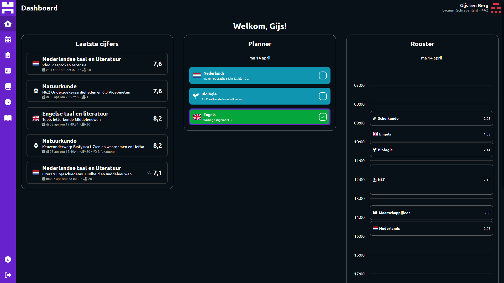

# Somtomorrow

A next-gen Somtoday webapp that works how students want it to work.  
Built with the amazing Flask framework and the Jinja templating engine.  
It's currently still a prototype, but what we have already built is quite great :D

## Run yourself

Flask is very simple, so this is all you need to run the app locally:

- Clone and cd into the repo
- Run `pip install -r requirements.txt` to install stuff
- Run `python main.py` (Windows and some Linux and macOS installations) or `python3 main.py` (Linux and macOS)
- Visit `localhost:4000` and there it is!

## To-do

Yeah it's a lot...

### Auth

- [ ] Login once and store the refresh token -> connect somtd with somtm acc or just automatic logins with sessions?
- [ ] Maybe look into using the Somtoday login after all with a kind of redirect?
- [ ] Fix Authtoday

### Features

- [ ] Add notification system for grades (easy) and schedules (certainly impossible) (with Firebase???)

### Pages

#### Dashboard

- [ ] Better design
- [ ] Add recently used leermids
- [ ] Add next schedule appo

#### Grades

- [ ] Add reports
- [ ] Clean up the herkansing data and make it a list?
- [ ] Add future tests (empty test columns)
- [ ] Add grade page for each subject
- [ ] Add *deeltoetsen*
- [ ] Add calculator for which grade you need to get
- [ ] Add stats
  - [ ] Timeline for each grade
  - [ ] Histograph for all grades
  - [ ] Median, average and stuff

#### Schedule

- [ ] Differ between appointment types (*inidvidueel*, *rooster*, *examen*, *toets*)

#### Other

- [ ] Leermids
- [ ] Afwezigheid
- [ ] Subjects (also leermids???)
